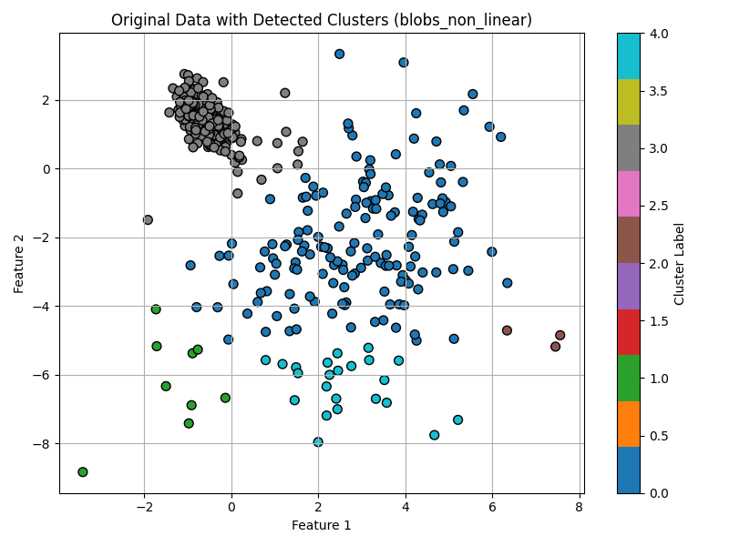
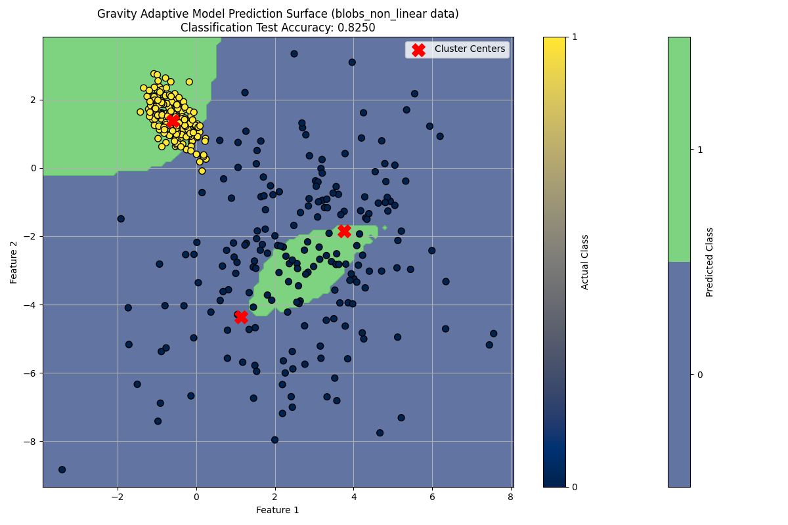

# Gravity Adaptive Model (GAM)

## Project Overview

The **Gravity Adaptive Model (GAM)** is a new machine learning approach designed to address the limitations of traditional linear models by creating a flexible, non-linear prediction surface. It achieves this by combining a novel physics-inspired clustering method with local, adaptively complex regression/classification models that are smoothly blended across the feature space.

Traditional linear models often struggle with non-linear or complex data, leading to underfitting. GAM proposes to overcome this by:

*   **Identifying natural data clusters:** Using a "gravitational pull" metaphor, data points are attracted to regions of high density, forming natural clusters.
*   **Fitting local models:** For each identified cluster, a specialized regression or classification model is trained on the data within that cluster. The complexity of these local models can be adapted (e.g., using polynomial features).
*   **Smoothly blending predictions:** For any new data point, predictions from all local models are combined, weighted by the new point's proximity to each cluster. This creates a continuous and "bending" prediction surface that naturally adapts to complex, non-linear relationships in the data.

This approach effectively allows the model to learn different relationships in different parts of the data, while maintaining a smooth overall prediction.

## Core Concepts & Mathematical Formulation

The GAM is built upon several key ideas, executed in two main phases, followed by a blending mechanism:

### 1. Gravity-Based Clustering (Phase 1)

This phase aims to identify natural clusters within the data by simulating a gravitational attraction between data points.

*   **Data Points:** Let $X = \{x_1, x_2, \ldots, x_N\}$ be the set of $N$ input data points, where each $x_i \in \mathbb{R}^D$ (D-dimensional feature vector).
*   **Influence/Gravitational Force:** The "force" or "influence" exerted by point $x_j$ on $x_i$ is modeled using a Gaussian (Radial Basis Function) kernel, which ensures highly localized interaction:
    $I(x_i, x_j) = \exp(-\gamma ||x_i - x_j||^2)$
    where $||x_i - x_j||^2$ is the squared Euclidean distance between $x_i$ and $x_j$, and $\gamma > 0$ is the **bandwidth parameter** (`gamma_clustering` in code), controlling the spread of influence. A larger $\gamma$ means a more localized force.
*   **Iterative Movement:** Points iteratively move towards regions of higher density. For each point $x_i$, its new position is calculated as the weighted average of all other points' current positions, where weights are determined by the gravitational influence:
    $x_i^{\text{new}} = \frac{\sum_{j\neq i} I(x_i^{\text{current}}, x_j^{\text{current}}) \cdot x_j^{\text{current}}}{\sum_{j\neq i} I(x_i^{\text{current}}, x_j^{\text{current}})}$
    
    This iterative process (`n_iterations_clustering` in code) allows points to converge towards modes of density in the feature space.
*   **Cluster Identification:** After $k$ iterations, points that have converged to sufficiently close locations are grouped into clusters using Agglomerative Clustering (`clustering_distance_threshold` in code).

### 2. Adaptive Local Modeling (Phase 2)

Once clusters $C_1, C_2, \ldots, C_M$ are identified, a specialized regression or classification model is trained for each cluster.

*   **Local Model Training:** For each cluster $C_m$, a subset of the original data $D_m = \{(x_i, y_i) \mid x_i \in C_m\}$ is used to train a local model $f_m$.
    *   Each $f_m$ is a polynomial regression/classification model. This is achieved by first transforming the input features $x$ using `PolynomialFeatures` (`local_model_degree` in code) to generate higher-order and interaction terms, resulting in $\phi(x)$.
    *   For regression tasks, `Ridge` regularization is applied to these polynomial regressions. The local model $f_m(x)$ then takes the form:
        $f_m(x) = w_m^{T}\phi(x)$
        The coefficients $w_m$ are learned by minimizing the Ridge objective function:
        $\min_{w_m} ||Y_m - \Phi_m w_m ||^2 + \lambda||w_m||^2$
        Here, $Y_m$ is the vector of target values for data points in cluster $C_m$, $\Phi_m$ is the design matrix where each row corresponds to the polynomial features $\phi(x_i)$ for $x_i \in C_m$, and $\lambda$ is the **regularization strength** ($\lambda \ge 0$), a hyperparameter that controls the balance between fitting the training data well and keeping the model weights small.
    *   For classification tasks, `LogisticRegression` is used with polynomial features.

### 3. Smooth Blending of Predictions

For a new, unseen data point $x_{\text{new}}$, the final prediction is a weighted sum (or weighted average of probabilities for classification) of the predictions from all local models.

*   **Cluster Centers:** Each cluster $C_m$ is represented by a center $c_m$, typically the mean of the original data points within that cluster.
*   **Blending Weights:** The contribution of each local model $f_m$ to the final prediction is determined by a blending weight $B_m(x_{\text{new}})$, which measures the proximity of $x_{\text{new}}$ to the cluster center. This also uses a Gaussian kernel:
    $B_m(x_{\text{new}}) = \exp(-\alpha||x_{\text{new}} - c_m||^2)$
    where $\alpha > 0$ is the **blending bandwidth parameter** (`blending_alpha` in code).
*   **Normalized Blending Weights:** These weights are normalized across all clusters to sum to 1:

    $ \bar{B}_m (x_{\text{new}}) = \frac{B_m(x_{\text{new}})}{\sum_{k=1}^{M} B_k(x_{\text{new}})}$
*   **Final Prediction:** The overall prediction $\hat{y}(x_{\text{new}})$ is the blended sum:
    $ \hat{y}(x_{\text{new}}) = \sum_{m=1}^M \bar{B}_m(x_{\text{new}}) \cdot f_m(x_{\text{new}})$
    For classification, $f_m(x_{\text{new}})$ provides class probabilities, and the sum $\hat{y}(x_{\text{new}})$ results in a final probability distribution. This mechanism ensures a continuous and smooth "bending" prediction surface that adaptively responds to the local data structure.

For more indepth explanation of the math please visit `Gravity_Adaptive_Model_GAM.pdf` document in the project root.

## Hyperparameters

The model's behavior and performance are significantly influenced by its hyperparameters. These can be configured via command-line arguments when running `main.py`.

| Parameter                     | Type    | Default Value | Description                                                                                                                                                                                                                                                       |
| :---------------------------- | :------ | :------------ |:------------------------------------------------------------------------------------------------------------------------------------------------------------------------------------------------------------------------------------------------------------------|
| `--task_type`                 | `str`   | `classification`| The type of machine learning task. Can be `regression` or `classification`. This determines the type of local models used (Ridge Regression or Logistic Regression) and evaluation metrics.                                                                       |
| `--data_source`               | `str`   | `circles`     | The dataset to use for the experiment.                                                                                                                                                                                                                            |
|                               |         |               | - `moons_blobs`: Complex non-linear regression data.                                                                                                                                                                                                              |
|                               |         |               | - `circles`: Concentric circles classification data.                                                                                                                                                                                                              |
|                               |         |               | - `blobs_non_linear`: Highly non-linear blobs classification data.                                                                                                                                                                                                |
|                               |         |               | - `titanic`: Real-world tabular classification data.                                                                                                                                                                                                              |
|                               |         |               | - `parabola`: Parabolic regression data.                                                                                                                                                                                                                          |
|                               |         |               | - `linear_like`: Simple linear regression data.                                                                                                                                                                                                                   |
| `--n_samples`                 | `int`   | `400`         | Number of samples to generate for synthetic datasets (`moons_blobs`, `circles`, etc.). This parameter is ignored for real-world datasets like `titanic`.                                                                                                          |
| `--gamma_clustering`          | `float` | `0.8`         | **Gamma ($\gamma$) parameter for Gravity-Based Clustering (Phase 1).** Controls the "locality" of the gravitational force. Higher values make the force more localized (tighter clusters), while lower values allow broader influence (fewer, larger clusters).   |
| `--n_iterations_clustering`   | `int`   | `5`           | Number of "theoretical time" steps for the points to converge in gravity clustering. More iterations lead to better convergence to density modes.                                                                                                                 |
| `--blending_alpha`            | `float` | `1.0`         | **Alpha ($\alpha$) parameter for Prediction Blending.** Controls the "locality" or "spread" of the blending influence. Higher values mean a local model's influence drops off faster with distance from its cluster center (more localized blending).             |
| `--local_model_degree`        | `int`   | `2`           | **Polynomial Degree for Local Models (Phase 2).** The maximum polynomial degree for `PolynomialFeatures` used in each local model. `1` means linear, `2` means quadratic, etc. Higher degrees allow more complex local fits but increase the risk of overfitting. |
| `--clustering_distance_threshold` | `float` | `0.5`         | Distance threshold used by `AgglomerativeClustering` to group converged points into final clusters. Directly impacts the number of detected clusters.                                                                                                             |


## Getting Started

### Prerequisites

*   Python 3.x
*   NumPy
*   Matplotlib
*   Scikit-learn
*   Pandas (for `titanic.csv` and similar tabular data)

You can install these using pip:
```bash
pip install numpy matplotlib scikit-learn pandas
```

## How to run the CLI client
The model configurations are in the hyperparameters, and those are all configurable using the execution command. If not configured, they use the default value.

The default setup uses circles testing data, to run with this data just run 
```bash
python main.py
```

To run non-linear testing data run
```bash
python main.py --data_source blobs_non_linear
```

Below is the result for this example

Original data:


Clustering:


By tweaking the hyperparameters and for example adjusting the `clustering_distance_threshold` and `blending_alpha` it is possible to get much better scores. This is visible when running the model with GridSearch (shown later). 


There is a titanic dataset downloaded from Kaggle for testing purposes and for the proof of concept to show that it is possible to use the classification with this model. To run it 
```bash
python main.py --data_source titanic
```
This will result to this kind of output:
```
Loading data from 'titanic' for 'classification' task...
Running Gravity Adaptive Model...
Phase 1: Running gravity clustering for 712 points...
Phase 1 complete. Found 8 clusters.
Phase 2: Training local models...
Phase 2 complete. All local models trained.

--- Evaluation for titanic (classification) ---
Accuracy on training data: 0.8329
Accuracy on test data: 0.7598

Classification Report on Test Data:
              precision    recall  f1-score   support

           0       0.80      0.82      0.81       110
           1       0.70      0.67      0.68        69

    accuracy                           0.76       179
   macro avg       0.75      0.74      0.74       179
weighted avg       0.76      0.76      0.76       179
```
This works as a proof of concept that the model works at some level. By tuning the hyperparameters it is possible to get much better results.

### Running GridSearchCV for hyperparameter optimization (for any dataset):
Execute the model to use the grid_search
```bash
python main.py --data_source [source] --run_grid_search
```

This will perform a search over the defined hyperparameter grid and print the best parameters found along with their cross-validation score.


